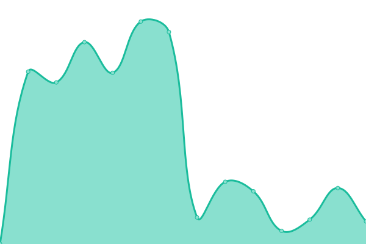
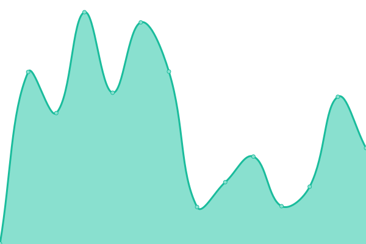
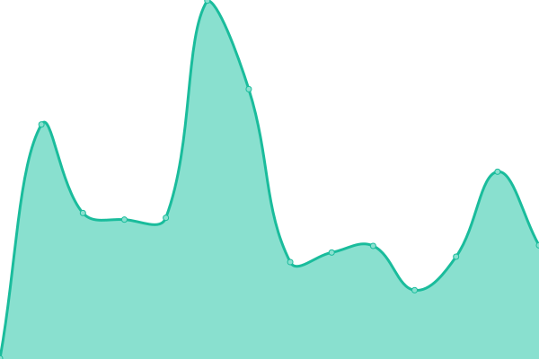
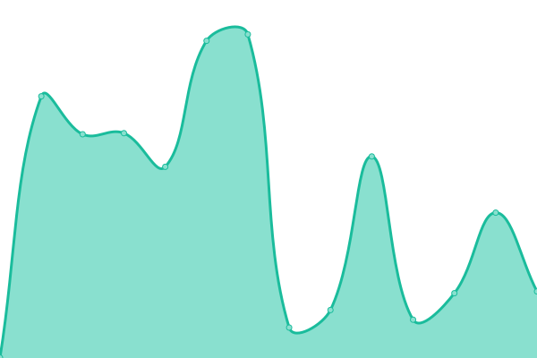
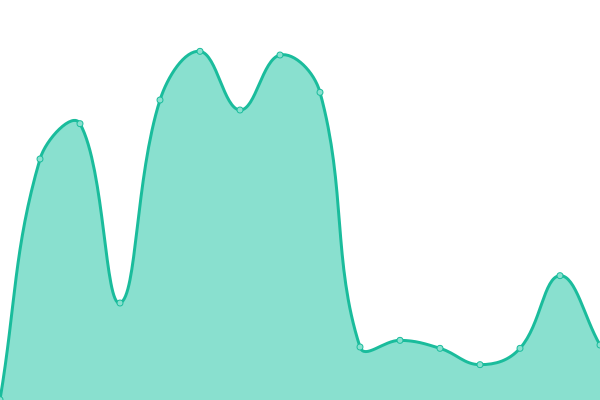

# [📈 Live Status](https://EarthAsylum.github.io/uptime): <!--live status--> **🟧 Partial outage**

This repository contains the open-source uptime monitor and status page for [EarthAsylum Consulting](https://earthasylum.com), powered by [Upptime](https://github.com/upptime/upptime).

With [Upptime](https://upptime.js.org), you can get your own unlimited and free uptime monitor and status page, powered entirely by a GitHub repository. We use [Issues](https://github.com/EarthAsylum/uptime/issues) as incident reports, [Actions](https://github.com/EarthAsylum/uptime/actions) as uptime monitors, and [Pages](https://EarthAsylum.github.io/uptime) for the status page.

<!--start: status pages-->
<!-- This summary is generated by Upptime (https://github.com/upptime/upptime) -->
<!-- Do not edit this manually, your changes will be overwritten -->
<!-- prettier-ignore -->
| URL | Status | History | Response Time | Uptime |
| --- | ------ | ------- | ------------- | ------ |
|  [{eac}Doojigger](https://eacdoojigger.earthasylum.com/?uptime) | 🟩 Up | [eac-doojigger.yml](https://github.com/EarthAsylum/uptime/commits/HEAD/history/eac-doojigger.yml) | 

 1159ms
     
 | 

<a href="https://EarthAsylum.github.io/uptime/history/eac-doojigger">98.76%</a>
    

|  [{eac}SoftwareRegistry](https://swregistry.earthasylum.com/?uptime) | 🟩 Up | [eac-software-registry.yml](https://github.com/EarthAsylum/uptime/commits/HEAD/history/eac-software-registry.yml) | 

 879ms
     
 | 

<a href="https://EarthAsylum.github.io/uptime/history/eac-software-registry">93.21%</a>
    

|  [EarthAsylum.com](https://earthasylum.com/?uptime) | 🟩 Up | [earth-asylum-com.yml](https://github.com/EarthAsylum/uptime/commits/HEAD/history/earth-asylum-com.yml) | 

 476ms
     
 | 

<a href="https://EarthAsylum.github.io/uptime/history/earth-asylum-com">98.69%</a>
    

|  [KevinBurkholder.com](https://kevinburkholder.com/?uptime) | 🟩 Up | [kevin-burkholder-com.yml](https://github.com/EarthAsylum/uptime/commits/HEAD/history/kevin-burkholder-com.yml) | 

 411ms
     
 | 

<a href="https://EarthAsylum.github.io/uptime/history/kevin-burkholder-com">98.69%</a>
    

|  [The Grooming Shed](https://thegroomingshed.care/?uptime) | 🟩 Up | [the-grooming-shed.yml](https://github.com/EarthAsylum/uptime/commits/HEAD/history/the-grooming-shed.yml) | 

 450ms
     
 | 

<a href="https://EarthAsylum.github.io/uptime/history/the-grooming-shed">98.69%</a>
    

|  [EarthAsylum.net](https://dev.earthasylum.net/?uptime) | 🟥 Down | [earth-asylum-net.yml](https://github.com/EarthAsylum/uptime/commits/HEAD/history/earth-asylum-net.yml) | 

 615ms
     
 | 

<a href="https://EarthAsylum.github.io/uptime/history/earth-asylum-net">94.14%</a>
    

<!--end: status pages-->

[**Visit our status website →**](https://EarthAsylum.github.io/uptime)

## 📄 License

- Powered by: [Upptime](https://github.com/upptime/upptime)
- Code: [MIT](./LICENSE) © [Anand Chowdhary](https://anandchowdhary.com), supported by [Pabio](https://pabio.com)
- Data in the `./history` directory: [Open Database License](https://opendatacommons.org/licenses/odbl/1-0/)
